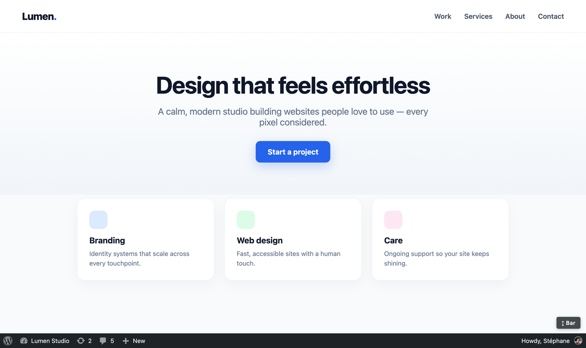
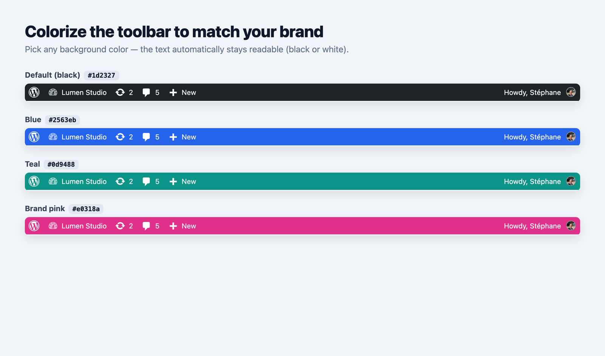
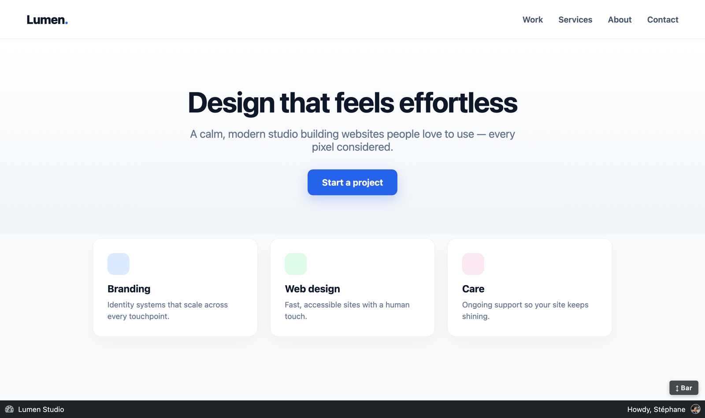
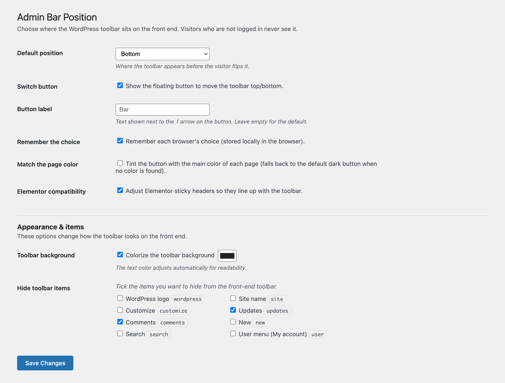
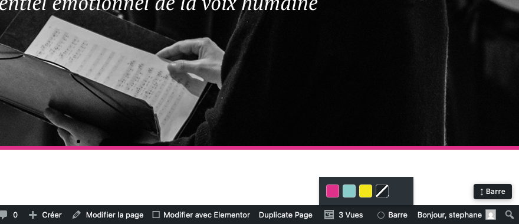
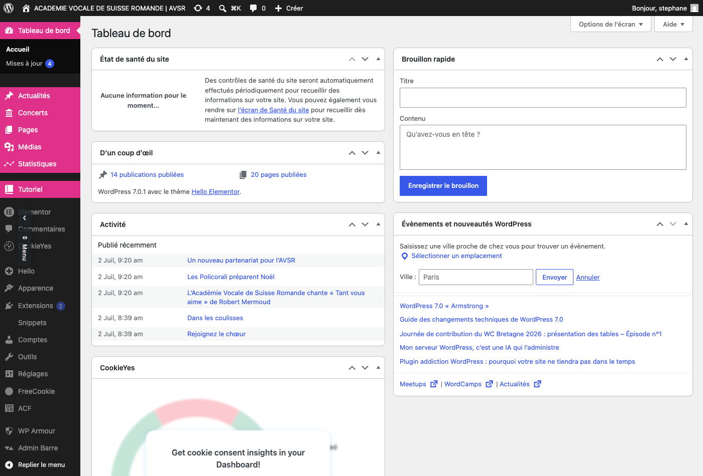
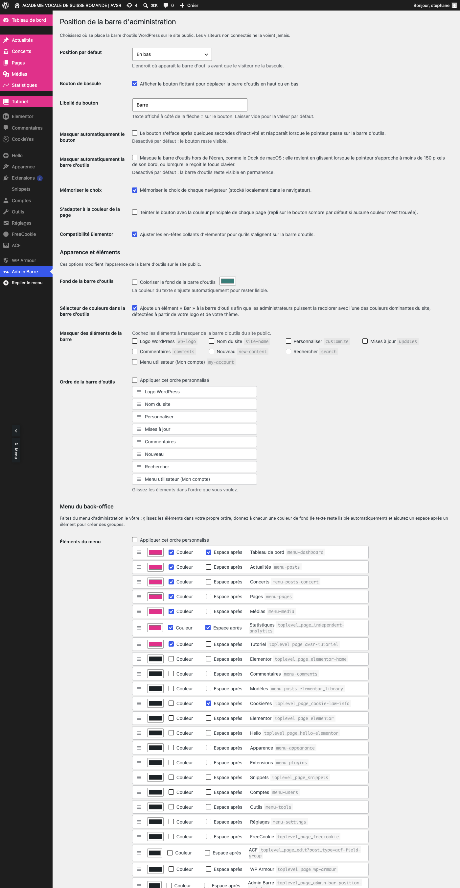
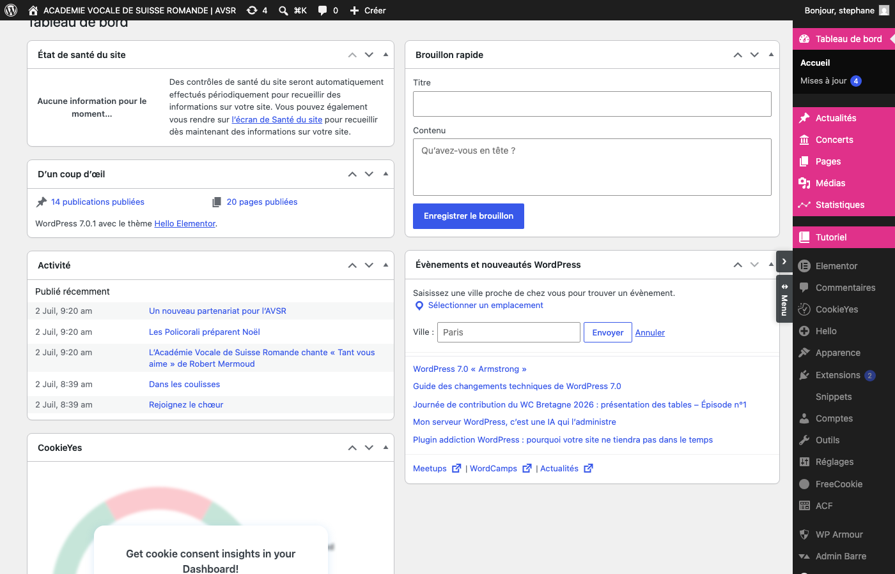
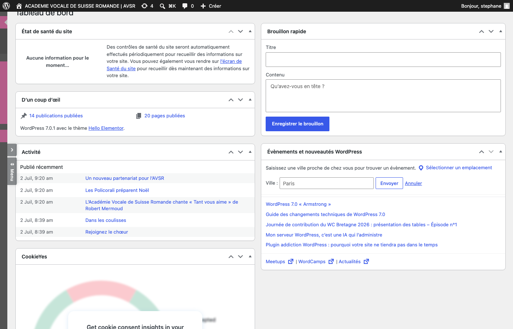

# Admin Bar Position Switcher

> Move the WordPress toolbar to the **bottom** of the screen on the front end, with a one‑click button to flip it top/bottom. The choice is remembered per browser.

A small, focused WordPress plugin. **GPL‑2.0‑or‑later.**

---

## Screenshots

<em>The WordPress toolbar moved to the bottom, with the “↕ Bar” switch button.</em>

<em>Colorize the toolbar — the text color stays readable automatically.</em>

<em>Hide the individual toolbar items you don’t need.</em>

<em>All options on one simple settings screen.</em>

<em>The "Bar" item in the toolbar: pick one of your site's dominant colors, detected from your logo and theme.</em>

<em>Colorize the back-office menu, add spacers between groups, and dim the technical items.</em>

<em>The full settings page (shown in French): positions, auto-hide, colors, and the back-office menu section.</em>

<em>The back-office menu flipped to the right side, with the floating tabs (hide/show and ↔ Menu).</em>

<em>Dock mode: the menu waits off-screen and glides back when the pointer approaches its edge.</em>

---

## Why

By default WordPress pins its toolbar to the **top** of every front‑end page for logged‑in users. That top bar pushes the whole layout down, hides the first pixels of the design, and often collides with sticky headers, hero sections, and full‑screen builders like Elementor.

**Admin Bar Position Switcher** moves the toolbar to the **bottom** instead, closes the empty gap WordPress reserves at the top, and adds a floating **"↕" button** so each user can send the bar back to the top or down to the bottom whenever they like.

Everything happens on the front end and **only for logged‑in users**. Visitors who are not logged in never see the toolbar or the button, and the plugin loads **nothing at all** on their pages — no CSS, no JavaScript.

## Features

- Places the WordPress toolbar at the bottom of the screen on the front end (default position is configurable).
- Floating "↕" button to switch the toolbar between top and bottom, on the fly.
- **Auto‑hide (opt‑in)** — off by default; when enabled, the button drifts away like a falling leaf after a few seconds of inactivity and floats back the moment your pointer moves anywhere over the toolbar (its full width), or it gains keyboard focus. A tap brings it back on touch, and it respects the "reduce motion" preference.
- Remembers each browser's choice (can be turned off).
- **Match the page color** — optionally tints the button with the main color of the current page (theme color, palette, or header background), with automatic black/white text for contrast. Falls back to a neutral dark button when no color is found.
- **Hide toolbar items** — remove individual items you don't want (WordPress logo, Comments, + New, Updates, …).
- **Colorize the toolbar** — set a custom background color for the bar, with automatically readable text.
- **Recolor from the toolbar itself** — a small "Bar" item (administrators only) reveals the site's five dominant colors on hover; one click recolors the bar and saves the choice. Colors are auto‑detected fully locally from your logo (PNG/SVG), Elementor kit, theme.json, Customizer settings, and a frequency scan of the home page.
- **Auto‑hide the toolbar, macOS Dock style (opt‑in)** — the bar glides off‑screen and slides back when the pointer comes within 150px of its edge, or when it receives keyboard focus. The reserved space is released while it is hidden, and once revealed it stays for at least 10 seconds.
- **Move, hide or auto‑hide the back‑office menu** — two floating vertical tabs sit on the menu's outer edge: one hides or shows the menu on demand (the page takes the full width), the other flips it between left and right. Both choices are remembered per browser, and an optional macOS‑Dock mode also hides the menu off‑screen until the pointer comes within 150px of its edge.
- **Reorder by drag & drop** — the back‑office menu list combines order, color and spacing in one place (drag the handle), and a second sortable list reorders the toolbar; the saved order is global and reversible per zone.
- **Colorize the back‑office menu** — give each item of the left admin menu its own background color (text stays readable automatically), add space after an item to build groups, and optionally **dim the technical items** (they light up on hover or when active) so the everyday menus stand out.
- Removes WordPress's reserved top spacer when the bar is at the bottom, so there is no empty gap.
- Opens the toolbar sub‑menus upward when the bar is at the bottom.
- Optional Elementor compatibility so sticky headers line up with the toolbar.
- Clean, no external requests, no tracking, no cookies (the preference lives in `localStorage`).

## Settings

**Admin Bar Position** (top-level entry in the left admin menu)

| Setting | What it does |
| --- | --- |
| Default position | Where the toolbar starts (bottom or top). |
| Switch button | Show or hide the floating "↕" button. |
| Button label | Text shown next to the arrow (default: "Bar"). |
| Auto-hide the button | Let the button drift away when idle and float back near the toolbar (off by default). |
| Auto-hide the toolbar | Hide the bar off-screen like the macOS Dock; it glides back within 150px (off by default). |
| Remember the choice | Store each browser's top/bottom preference. |
| Match the page color | Tint the button with the page's main color. |
| Elementor compatibility | Align Elementor sticky headers with the toolbar. |
| Toolbar background | Set a custom background color for the bar (text stays readable). |
| Color picker in the toolbar | Show the "Bar" item that recolors the toolbar with the site's dominant colors. |
| Hide toolbar items | Hide individual items from the front-end toolbar. |
| Menu items | One drag-and-drop list: reorder the left admin menu, color each item and add space after it. |
| Toolbar order | Drag-and-drop list to reorder the toolbar items. |
| Menu side | Default side of the wp-admin menu + the floating tabs (hide/show and left/right). |
| Auto-hide the menu | Hide the wp-admin menu off-screen, Dock style (off by default). |

## Installation

1. Install from the WordPress Plugin Directory (once published), or upload the `admin-bar-position-switcher` folder to `/wp-content/plugins/`.
2. Activate the plugin through the **Plugins** screen.
3. (Optional) Open **Admin Bar Position** in the left admin menu to tune the defaults.

## Translations

Ships translated into **26 languages** (full UI): French, Spanish, German, Italian, Portuguese (Portugal & Brazil), Dutch, Russian, Japanese, Chinese (Simplified & Traditional), Korean, Arabic, Polish, Swedish, Danish, Norwegian, Finnish, Czech, Turkish, Greek, Hebrew, Hungarian, Romanian, Ukrainian and Indonesian. Contributions of new or improved translations are welcome.

## Author

Built and maintained by **Stéphane Schmidt** — a web designer and developer based in Switzerland.

Stéphane crafts clean, human‑friendly WordPress sites, often for cultural and non‑profit projects, and develops hand in hand with **Claude Code** with a lot of enthusiasm. **Available for freelance work** — reach him at **stephane@alveo.design**, on [alveo.design](https://alveo.design), on [Facebook](https://www.facebook.com/free.stephane), on [Instagram](https://www.instagram.com/free.stephane/), or on [TikTok](https://www.tiktok.com/@freestephane).

If this plugin is useful to you, you can **[buy him a coffee](https://revolut.me/stphanjt11)** — thank you. (A small "Support the author" card with these links is also built into the plugin's settings screen, translated into every bundled language.)

## License

This plugin is free software, released under the **GNU General Public License v2.0 or later**. See [LICENSE](LICENSE).
